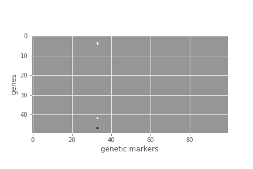
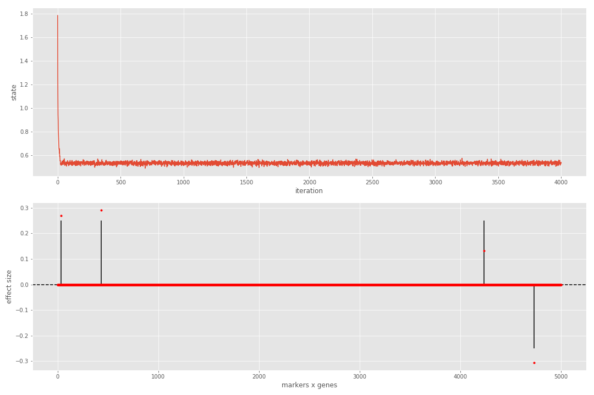

# Hierarchical probabilistic models for multiple gene/variant associations based on NGS data

The identification of genetic variants affecting gene expression (known as *expression
quantitative trait loci* or *eQTLs*) is an important step in unravelling the genetic
basis of complex traits, including diseases. *eQTLseq* implements two classes of
statistical models for detecting *simultaneously* multiple associations between gene
expression and genomic polymorphisms in a population, using paired DNA-seq and RNA-seq
assays as input:

  1. The first class involves *Poisson*, *Binomial* and *Negative Binomial* models,
  which explicitly model digital gene expression as a function of genetic variation.

  2. The second class involves a *Normal*/*Gaussian* model, which relies on appropriate
  transformations of gene expression data.

All models are embedded in a Bayesian multiple/multivariate regression and variable
selection framework. Importantly, in all cases, the posterior probability of multiple
gene/variant associations is expressed as a multivariate Normal distribution through
the introduction of latent variables, which allows for efficient Bayesian learning.
Details of all statistical methods are given in the following paper:

"*Hierarchical probabilistic models for multiple gene/variant associations based on
NGS data*" by Dimitrios V. Vavoulis, Jenny C. Taylor & Anna Schuh, **2017** (submitted)

For further information, please send a message to <Dimitris.Vavoulis@ndcls.ox.ac.uk>.

Below, you can find instructions for installing and using the software. Enjoy!

## Installation

*eQTLseq* requires **Python 3** (I developed it using v3.5). The easiest way to install it is using `pip`:

```bash
me@here:~$ pip install -U eQTLseq
```

Required dependencies (`numpy`, `scipy`, `tqdm`, `rpy2`) will be installed
automatically. I strongly recommend installing inside a fresh virtual environment. You can create one using something like: `python3 -m venv ~/path/to/your/virtual/environments/test`.

## Usage

Let's see how *eQTLseq* works on [a simulated dataset](data/simdata_1_4_0_0.pkl).
Save this in a convenient location and, from an `ipython` console or notebook, do
the following:

```python
## imports data
import pickle as pkl
import numpy as num
import numpy.random as rnd
import matplotlib.pyplot as plt

## load data
with open('/path/to/simdata_1_4_0_0.pkl', 'rb') as fh:
  data = pkl.load(fh)

Z = data['Z']     # simulated expression data
G = data['G']     # simulated genotypes
B = data['beta']  # the true matrix of gene/variant associations

## print/plot info
print(Z.shape)    # 50 genes x 1000 samples
print(G.shape)    # 1000 samples x 100 genetic markers
print(B.shape)    # 50 genes x 100 genetic markers
```

As you can see, the data consists of a matrix of read counts *Z* for 50 genes and a
matrix of genotypes *G* for 100 variants, both across 1000 samples.

```python
plt.figure();
plt.imshow(B, cmap=plt.cm.Greys_r);
plt.xlabel('genetic markers');
plt.ylabel('genes');
```



From the above visualization of *B*, you can see that a single variant influences
the expression of four genes. This is known as a *hotspot*.

In order to process the above data, we proceed as follows:

```python
import eQTLseq as seq

Z_norm = Z / seq.calculate_norm_factors(Z)        # normalize data
Z_trans = seq.transform_data(Z_norm, kind='log')  # transform data

## run Gibbs sampler
rnd.seed(0)
res = seq.run(Z_trans.T, G, n_iters = 4000, burnin=0.5, model='Normal', n_threads=1)
```

So, after normalizing and log-transforming the data, we pass it to function `run`,
which runs for 4000 iterations (`n_iters=4000`), rejecting the first half as burn-in
(`burnin=0.5`). Notice that the expression matrix *Z_trans* is first transposed and
then passed to `run`, because this function requires a *samples x genes* expression
matrix and a *samples x genetic markers* matrix of genotypes. We use a Normal model
(`model=Normal`) and, since we have a relatively small number of genes, we only use
a single thread (`n_threads=1`). The normalization factors
(`calculate_norm_factors`) are computed using the *relative log expression* (RLE)
method, which is also used by *DESeq*. Other options for parameter `kind` in function
`transform_data` are `logit`, `arcsin`, `blom` and `boxcox`. Transforming the data
is necessary, if `model=Normal`. Other options for `model` are `Poisson`, `Binomial`
and `NBinomial`, in which case data transformation is not necessary.

After the sampler finishes, we can visualize the results as shown below:

```python
## normalize beta
Bhat = res['beta']
Bhat = Bhat / nmp.abs(Bhat).sum()
Bnorm = B / nmp.abs(B).sum()

## plot
plt.figure(figsize=(15,10))

plt.subplot(2,1,1);
plt.plot(res['state'][1:]); plt.xlabel('iteration'); plt.ylabel('state')

plt.subplot(2,1,2);
plt.vlines(range(Bnorm.size), 0, Bnorm.ravel());
plt.axhline(linestyle='--', color='k');
plt.plot(Bhat.ravel(), 'r.'); plt.xlabel('markers x genes'); plt.ylabel('effect size');

## compute metrics
metrics = seq.calculate_metrics(Bhat, Bnorm)
print([metrics[_] for _ in ('MCC', 'FDR')])
```



We can see that the sampler reaches steady state very quickly and that all true
associations have been detected. If we repeat the process for [a more complicated
dataset](data/simdata_1_8_0_0.pkl), the results are contaminated with a single false
positive.


In practise, we can reject all discoveries below a threshold (e.g. 25% of
the maximum in magnitude effect size). We can enforce this condition in the
computation of metrics (last two lines of the above code) as follows:

```python
metrics = seq.calculate_metrics(Bhat, Bnorm, beta_thr=0.25)
print([metrics[_] for _ in ('MCC', 'FDR')])
```

We can see that this takes care of the false positive, thus benefiting the metrics.   
